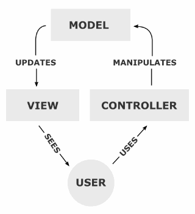

# MVC 패턴 이란 ? 

## 디자인패턴중 하나인 MVC 패턴
 디자인 패턴이란 프로그램이나 어떤 특정한 것을 개발하는 중에 발생했던 문제점들을 정리해서 상황에 따라 간편하게 적용해서 쓸 수 있는 것을 정리하여 특정한 **규약**을 통해 쉽게 쓸 수 있는 형태로 만든 것을 말합니다

## MVC 란
> **Model, View, Controller**의 약자이다
> 하나의 애플리케이션 프로젝트를 구성할 때 그 구성요소를 세가지의 역활로 구분한 패턴이다.

> 위의 그림처럼 사용자가 CONTROLLER를 조작하면 CONTROLLER는 MODEL을 통해서 데이터를 가져오고 그 정보를 바탕으로 시각적인 표현을 담당하는 View를 제어해서 사용자에게 전단할게 된다.

## 모델, Model
>애플리케이션의 정보, 데이터를 나타낸다. (데이터베이스 , 처음의 정의하는 상수, 초기화값, 변수 등) DATA,정보를 가공을 책임지는 컴포넌트를 뜻한다.
### 모델의 규칙
**1.** 사용자가 편집하길 원하는 모든 데이터를 가지고 있어야 한다. 

> *추가설명* => 화면안의 네모박스에 글자가 표현된다면, 네모박스의 화면 위치 정보, 네모박스의 크기정보, 글자내용, 글자의 위치, 글자의 포맷 정보 등을 가지고 있어야 한다는 것이다.

**2.** 뷰나 컨트롤러에 대해서 어떤 정보도 알지 말아야 한다.

> *추가설명* => 데이터 변경이 일어났을 때 모델에서 화면 UI를 직접 조정해서 수정할 수 있도록 뷰를 참조하는 내부 속성값을 가지면 안된다는 말이다.

**3.** 변경이 일어나면, 변경 통지에 대한 처리방법을 구현해야만 한다.

> *추가설명* => 모델의 속성 중 텍스트 정보가 변경이 된다면, 이벤트를 발생시켜 누군가에게 전달해야 하며, 누군가 모델을 변경하도록 요청하는 이벤트를 보냈을 때 이를 수신할 수 있는 처리 방법을 구현해야 합니다. 또한 모델은 재사용가능해야 하며 다른 인터페이스에서도 변하지않아야 합니다.

## 뷰, View
> Input텍스트, 체크박스 항목 등과 같은 사용자 인터페이스 요소를 나타냅니다. 다시 말해 데이터 및 객체의 입력, 그리고 보여주는 출력을 담당합니다. 데이터를 기반으로 사용자들이 볼 수 있는 화면입니다.
### 뷰의 규칙
**1.** 모델이 가지고 있는 정보를 따로 저장해서는 안된다.

> *추가설명* => 화면에 글자를 표시 하기 위해, 모델이 가지고 있는 정보를 전달받게 될텐데, 그정보를 유지하기 위해서 임의의 뷰 내부에 저장하면 안됩니다. 단순히 네모 박스를 그리라는 명령을 받으면, 화면에 표시하기만 하고 그 화면을 그릴 때 필요한 정보들은 저장하지 않아야 한다.

**2.** 모델이나 컨트롤러와 같이 다른 구성요소들을 몰라야 된다.

> *추가설명* => 모델과 같은 자기 자신 빼고는 다른 요소는 참조하거나 어떻게 동작하는지 알아서는 안됩니다. 그냥 뷰는 데이터를 받으면 화면에 표시해주는 역활만 가진다고 보면 된다.

**3.** 변경이 일어나면 변경통지에 대한 처리방법을 구현해야만 한다.
> *추가설명* => 모델과 같이 변경이 일어났을 때 누군가에게 변경을 알려줘야 하는 방법을 구현해야 합니다. 뷰에서는 화면에서 사용자가 화면에 표시된 내용을 변경하게 되면 이를 모델에게 전달해서 모델을 변경해야 할것이다. 그 작업을 하기 위해 변경 통지를 구현합니다. 그리고 재사용하게끔 설계를 해야 하며 다른 정보들을 표현할 때 쉽게 설계를 해야 합니다.

## 컨트롤러, Controller
> 데이터와 사용자인터페이스 요소들을 잇는 다리역확을 합니다. 즉 사용자가 데이터를 클릭하고, 수정하는 것에 대한 "이벤트"들을 처리하는 부분을 뜻합니다.
### 컨트롤러의 규칙
**1.** 모델이나 뷰에 대해서 알고 있어야 한다.

> *추가설명* => 모델이나 뷰는 서로의 존재를 모르고, 변경을 외부로 알리고, 수신하는 방법만 가지고 있는데 이를 컨트롤러가 중재하기 위해 모델과 그에 관련된 뷰에 대해서 알고 있어야 합니다.

**2.** 모델이나 뷰의 변경을 모니터링 해야 한다.

> *추가설명* => 모델이나 뷰의 변경 통지를 받으면 이를 해석해서 각각의 구성 요소에게 통지를 해야 합니다. 또한 애플리케이션의 메인 로직은 컨트롤러가 담당하게 됩니다.

