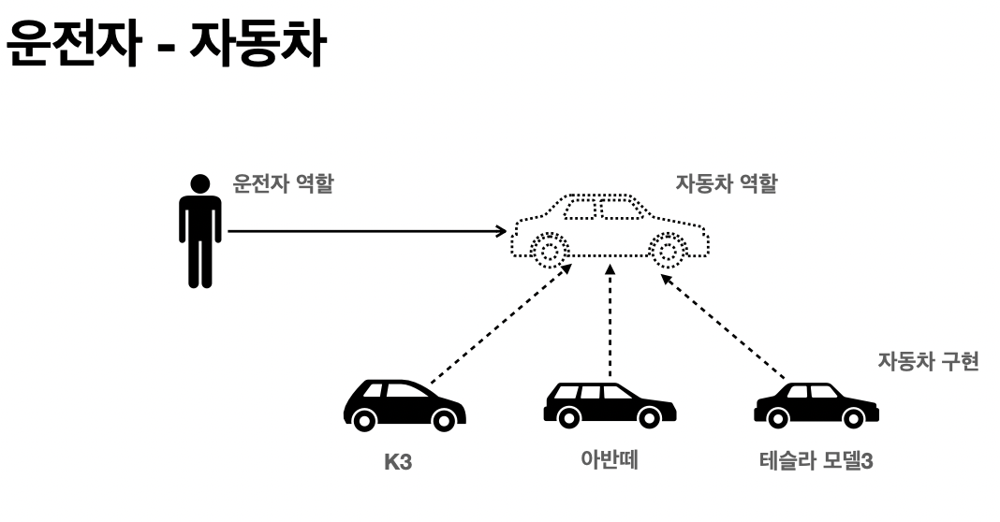

## 객체 지향 프로그래밍 이란?

* 객체 지향 프로그래밍은 컴퓨터 프로그램을 명령어의 목록으로 보는 시각에서 벗어나 여러개의 독립된 단위, 즉 **객체 들의 모임** 으로 파악하고자 한다.
* 각각의 객체는 메시지를 주고받고, 데이터를 처리할 수 있다.**(협력)**
* 객체 지향 프로그래밍은 프로그램을 **유연하고 변경이 용이하게 만들기 때문**에 대규모 소프트웨어 개발에 많이 사용된다

#### 유연하고 변경이 용이하다?
* 레고 블럭 조립하듯이
* 키보드, 마우스 갈아 끼우듯이
* 컴퓨터 부품 갈아 끼우듯이
* 컴포넌트를 쉽고 유연하게 변경하면서 개발할수 있는 방법

## 다형성
#### 다형성의 실세계 비유
이 세상을 **역활** 로 한다면 이 역활을 행하는 걸 **구현**으로 구분 해보겠다.

### 운전자 - 자동차

자동차 역활을 이 세 개의 다른 자동차들이 구현을 하고 있다. 
여기서 알수 있는 사실은 **자동차가 바뀌어도 운전자에게 영향을 주지 않는다** (유연하고 변경이 용이하다)  
이게 가능한 이유는, **자동차 역활의 인터페이스를 따라 자동차를 구현**했기 때문이다!  
운전자들은 단지 이 **인터페이스에** 대해서만 알고 있으면 된다( 자동차 역활에 대해서만 의존 하고 있으면 됨 )

 
인터페이스 : 자동차 역활  
구현체 : K3, 아반떼, 테슬라 모델3  
